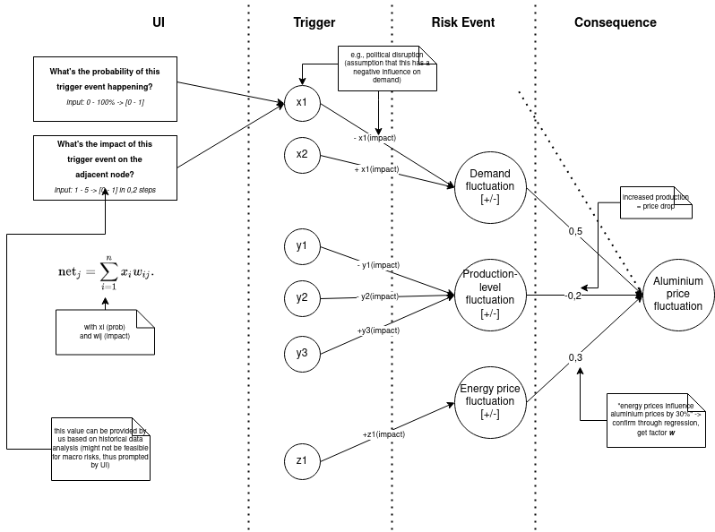

# IAPR_TK

Project Seminar Identifying and Analyzing Procurement Risks in cooperation with ThyssenKrupp

## Concept

## Correlation Plot
### Energy price has linear relationship with aluminium price 
### US doller index has polynomial relationship with alumiuim price

## Concept Value
### Energy price and US doller index have strong positive and negative relationships with aluminium price 

